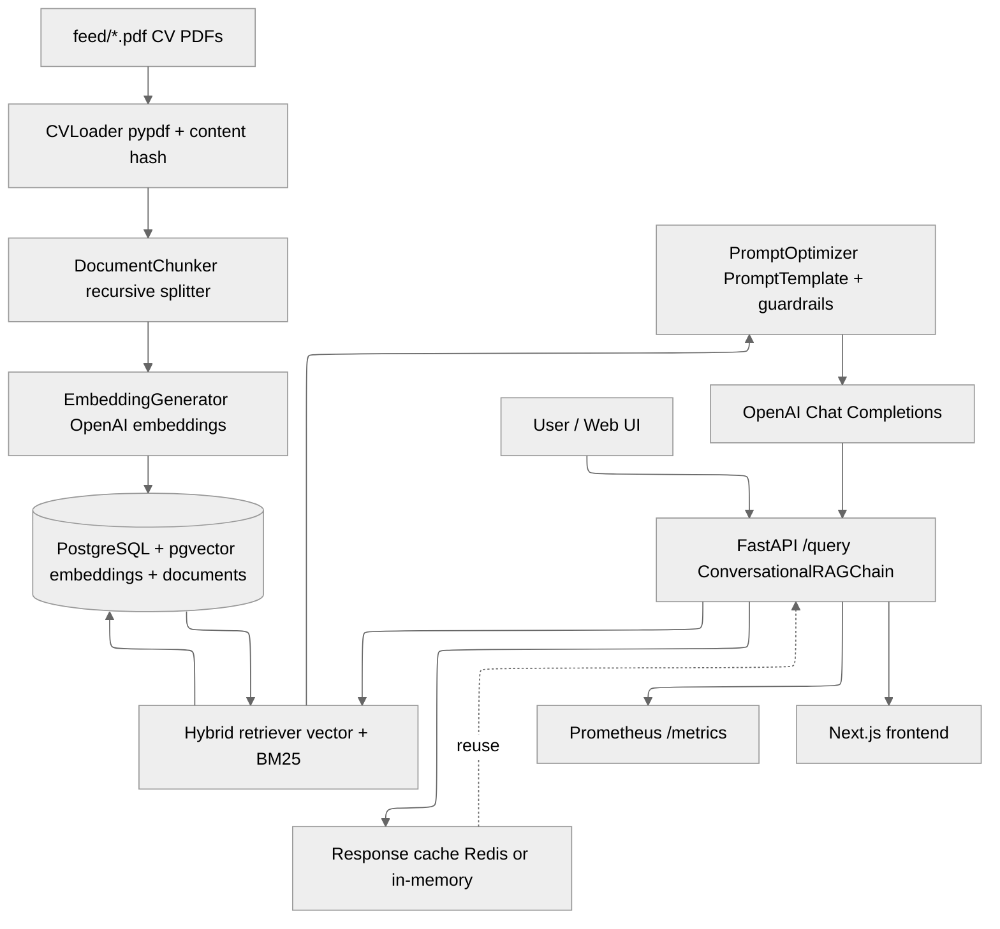

# CV Screener

End-to-end CV Screener: ingest PDF resumes, embed them into PostgreSQL + pgvector, serve a RAG API with hybrid
retrieval/caching/metrics, and a Next.js recruiter UI for source-backed answers.

## Stack

Technologies and services used across the app.

- Docker Compose orchestration for PostgreSQL + pgvector, Embedder, API, and Web UI.
- OpenAI `text-embedding-3-small` (embeddings) and `gpt-5-mini-2025-08-07` (generation).
- FastAPI + hybrid retrieval (`VectorRetriever` + BM25 rerank) with optional Redis caching.
- Observability with Prometheus metrics; caching via Redis or in-memory fallback.
- Next.js (App Router), Tailwind 4, shadcn/ui frontend for the recruiter chat UI.

## Quick Start

Fast path to run the database, embed CVs, and expose the API/web UI.

1) Clone the repo

2) Copy envs and set secrets:

```bash
cp .env.example .env
# set OPENAI_API_KEY and POSTGRES_PASSWORD
```

3) Drop your CV PDFs into `feed/`.
   - Right now is prefilled with some samples
   - You can use the [dummy-cv-generator](https://github.com/poacosta/dummy-cv-generator) project to generate new ones for demo purposes.

4) Run the full pipeline (DB -> embed feed -> build API -> start web UI):

```bash
make run
# Web UI:  http://localhost:3000
# API:     http://localhost:8000
# Metrics: http://localhost:9000/metrics
```

5) Enjoy at http://localhost:3000


## Core Commands

Make targets for bringing up services and running tests.

- `make setup`        — start PostgreSQL
- `make pipeline`     — embed feed, build the API and start the Web UI
- `make run`          — setup + pipeline
- `make test`         — run embedder + API tests

### Component Tests

Focused test commands for each component.

- `make test-embedder`
- `make test-api`

## Architecture & Data Flow

High-level ingestion and serving flow across services.



**Ingestion pipeline**

- Drop PDFs in `feed/`; `embedder` service reads them with `CVLoader` (pypdf) and skips unchanged files via MD5 hashes
  of the extracted text.
- `DocumentChunker` (recursive character splitter) creates overlapping chunks; `EmbeddingGenerator` batches them through
  OpenAI embeddings with retries.
- Chunks and document metadata are stored in PostgreSQL + pgvector via `VectorStore`, keeping content + embeddings
  aligned for retrieval.

**Serving path**

- FastAPI (`/query`) wires `VectorRetriever` over pgvector plus optional BM25 fusion (`HybridRetriever`) for hybrid
  ranking.
- Responses are cached (Redis if `REDIS_URL`, otherwise in-memory) and instrumented with Prometheus metrics.
- The Next.js web UI and curl clients both call the same API; CORS is open for quick integration.

## Project Structure

Map of top-level folders and what they contain.

| Path                 | Purpose                                                                                   |
|----------------------|-------------------------------------------------------------------------------------------|
| `api/`               | FastAPI service exposing `/query`; wires retrieval, prompt optimizer, caching, metrics.   |
| `api/rag/`           | Core RAG components (retrievers, reranker, prompt templates, guardrails, cache, metrics). |
| `embedder/`          | PDF ingestion, chunking, embedding, and persistence into PostgreSQL + pgvector.           |
| `database/`          | SQL init scripts for PostgreSQL/pgvector schema.                                          |
| `feed/`              | Drop your source CV PDFs here; mounted read-only into the embedder container.             |
| `web/`               | Next.js App Router frontend (chat UI, source panels, Tailwind/shadcn/ui).                 |
| `docker-compose.yml` | Orchestrates postgres, embedder, api, and web services.                                   |
| `Makefile`           | Convenience targets for setup, pipeline run, and tests.                                   |

## Web UI (Next.js)

Frontend chat experience for querying the CV knowledge base.

- Lives in `web/` (Next.js App Router, Tailwind 4 + shadcn/ui, Geist font, optional Vercel analytics).
- `app/page.tsx` renders a chat-style recruiter console: keeps a local message list, posts to
  `${NEXT_PUBLIC_API_URL}/query`, and appends the assistant reply plus sources to the transcript.
- Answers render with `react-markdown`; each assistant turn has a collapsible “Sources” panel showing title, URL,
  snippet,
  and citation number. `cv://` URLs are rewritten to `${NEXT_PUBLIC_API_URL}/cv/<slug>` if that endpoint exists.
- Includes preset example questions, optimistic loading state, and inline error messaging when the API is unreachable.
- Run locally with `cd web && pnpm install && pnpm dev` (or `npm run dev`). In Docker, `docker compose up web` binds to
  `WEB_PORT` (default 3000) and points at the API via `NEXT_PUBLIC_API_URL`.

## API

Public endpoints exposed by the FastAPI service.

- `GET /health` — readiness check
- `POST /query` — ask about candidates

Example request (queries and responses are English-only):

```bash
curl -X POST http://localhost:8000/query \
  -H "Content-Type: application/json" \
  -d '{"question": "What AWS experience does Evelyn Hamilton have?"}'
```

Example response:

```json
{
  "answer": "Evelyn Hamilton has built data pipelines on AWS using Glue and Lambda, and models in Redshift [1].",
  "sources": [
    {
      "title": "CV Evelyn Hamilton",
      "url": "cv://cv-01-evelyn-hamilton",
      "similarity": 0.91
    }
  ],
  "metadata": {
    "model": "gpt-5-mini-2025-08-07",
    "retrieved": 3,
    "top_k": 5
  }
}
```

## Prompt Construction (how answers are formed)

How prompts are built, optimized, and validated before calling the model.

- `ConversationalRAGChain` (api/rag/chain.py) normalizes the user question, fetches top-K chunks, and formats them as
  numbered sources with explicit “use and cite” instructions.
- `PromptOptimizer` (api/rag/optimizer.py) runs the query through `QueryAnalyzer` to (a) force English, (b) classify
  complexity, and (c) optionally expand ultra-short queries using recent chat history.
- The system prompt (api/rag/prompt_template.py) stacks three layers: META instructions (grounding, privacy,
  English-only, no path leaks), domain knowledge notes about CV structure, and task rules (markdown structure, [N]
  citations, single **Sources consulted** block).
- The user prompt injects few-shot examples, the retrieved context, prior conversation, and the new question under clear
  section headers; final turn is a “YOUR RESPONSE” cue to keep the model focused.
- Messages are sent as `[{"role": "system"}, {"role": "user"}]` to OpenAI Chat. After generation, guardrails validate
  citations/length/language, sources footers are normalized, the conversation history is extended, and the answer is
  cached for repeat hits.

### Prompting techniques used

Summary of prompt-engineering tactics layered into the chain.

- Layered instructions: strict META rules on grounding/privacy + domain knowledge + task rules to anchor outputs.
- Few-shot teaching: multiple examples of good/bad answers to steer citation style and tone.
- Context formatting: numbered sources with titles/URLs and explicit “use and cite” reminders.
- Short-query augmentation: expands terse queries using prior turns when enabled.
- Guardrails: post-checks for missing citations, phantom references, overlength, and language drift.

## Configuration (env)

Environment variables that configure the embedder, API, and web app.

| Variable                                         | Description                                                          | Default                  |
|--------------------------------------------------|----------------------------------------------------------------------|--------------------------|
| `OPENAI_API_KEY`                                 | OpenAI credentials for embeddings + chat                             | — (required)             |
| `DATABASE_URL` / `POSTGRES_*`                    | PostgreSQL connection string (see `docker-compose.yml` for defaults) | — (required)             |
| `APP_MODEL_NAME`                                 | Chat completion model for answers                                    | `gpt-5-mini-2025-08-07`  |
| `APP_PORT`                                       | FastAPI port                                                         | `8000`                   |
| `APP_LOG_LEVEL`                                  | API log level                                                        | `INFO`                   |
| `APP_TOP_K_RESULTS`                              | Default top-K results to return                                      | `5`                      |
| `APP_MAX_HISTORY`                                | Conversation turns to keep                                           | `10`                     |
| `CACHE_ENABLED` / `CACHE_TTL`                    | Toggle and TTL (seconds) for response cache                          | `true` / `3600`          |
| `REDIS_URL`                                      | Redis URL for cache backend (falls back to in-memory when empty)     | —                        |
| `RERANK_ENABLED` / `RERANK_TOP_K`                | Hybrid retrieval toggle and candidate pool size for re-rank          | `true` / `20`            |
| `METRICS_ENABLED` / `METRICS_PORT`               | Expose Prometheus metrics server                                     | `true` / `9000`          |
| `EMBEDDING_MODEL`                                | Embedding model for both embedder and retriever                      | `text-embedding-3-small` |
| `EMBEDDING_DIMENSION`                            | Embedding vector size (must match schema)                            | `1536`                   |
| `EMBEDDER_INPUT_DIR`                             | Path to PDFs (mounted into embedder container)                       | `/data/feed`             |
| `EMBEDDER_BATCH_SIZE`                            | Embedding batch size                                                 | `100`                    |
| `EMBEDDER_CHUNK_SIZE` / `EMBEDDER_CHUNK_OVERLAP` | Chunking parameters                                                  | `1000` / `200`           |
| `EMBEDDER_LOG_LEVEL`                             | Embedder log level                                                   | `INFO`                   |
| `WEB_PORT`                                       | Next.js port                                                         | `3000`                   |
| `NEXT_PUBLIC_API_URL`                            | Base API URL used by the web app                                     | `http://localhost:8000`  |

## Testing

How the project is validated and how to run the suites.

- **Make targets:** `make test` runs embedder and API test suites inside their containers; `make test-embedder` /
  `make test-api` run component-specific suites. Slow/unit/integration splits are available via `make test-slow`,
  `make test-unit`, `make test-integration`.
- **Embedder tests:** exercise PDF loading, chunking, embedding generation, and vector store interactions (hash-based
  skips, chunk counts).
- **API tests:** cover retrieval/chain wiring, prompt optimizer availability, and advanced features (prompt metadata,
  caching hooks, etc.) under `api/tests`.
- **How to run locally:** from project root, ensure Docker is running and execute `make test`; this starts the services
  with isolated dependencies defined in `docker-compose.yml`.
- **What’s not covered:** end-to-end frontend ↔ API is manual; UI is designed to surface errors from the API to aid
  manual checks.

## License

MIT License. See [LICENSE](LICENSE) for details.
