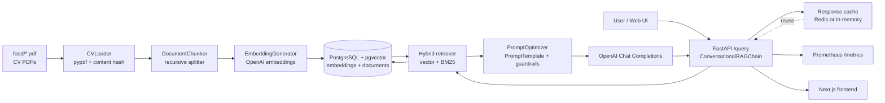

# CV Screener

Pipeline to ingest PDF resumes, embed them into PostgreSQL + pgvector, and expose a FastAPI endpoint for querying
candidate information with RAG.

## Stack

- Docker Compose (PostgreSQL + pgvector, Embedder, API)
- OpenAI `text-embedding-3-small` for embeddings and `gpt-5-mini-2025-08-07` for generation
- FastAPI with hybrid retrieval (vector + BM25) and Prometheus metrics

## Quick Start

1) Copy envs and set secrets:

```bash
cp .env.example .env
# set OPENAI_API_KEY and POSTGRES_PASSWORD
```

2) Drop your CV PDFs into `feed/`.

3) Run the full pipeline (DB -> embed feed -> start API):

```bash
make run
# API:     http://localhost:8000
# Metrics: http://localhost:9000/metrics
# Web UI:  http://localhost:3000
```

4) (Optional) Start the Next.js web UI against the running API:

```bash
docker compose up web
```

## Core Commands

- `make setup`        — start PostgreSQL
- `make pipeline`     — embed feed and start the API
- `make run`          — setup + pipeline
- `make test`         — run embedder + API tests

### Component Tests

- `make test-embedder`
- `make test-api`

## API

- `GET /health` — readiness check
- `POST /query` — ask about candidates

Example request (queries and responses are English-only):

```bash
curl -X POST http://localhost:8000/query \
  -H "Content-Type: application/json" \
  -d '{"question": "What AWS experience does Evelyn Hamilton have?"}'
```

Example response:

```json
{
  "answer": "Evelyn Hamilton has built data pipelines on AWS using Glue and Lambda, and models in Redshift [1].",
  "sources": [
    {
      "title": "CV Evelyn Hamilton",
      "url": "cv://cv-01-evelyn-hamilton",
      "similarity": 0.91
    }
  ],
  "metadata": {
    "model": "gpt-5-mini-2025-08-07",
    "retrieved": 3,
    "top_k": 5
  }
}
```

## Architecture & Data Flow



**Ingestion pipeline**

- Drop PDFs in `feed/`; `embedder` service reads them with `CVLoader` (pypdf) and skips unchanged files via MD5 hashes
  of the extracted text.
- `DocumentChunker` (recursive character splitter) creates overlapping chunks; `EmbeddingGenerator` batches them through
  OpenAI embeddings with retries.
- Chunks and document metadata are stored in PostgreSQL + pgvector via `VectorStore`, keeping content + embeddings
  aligned for retrieval.

**Serving path**

- FastAPI (`/query`) wires `VectorRetriever` over pgvector plus optional BM25 fusion (`HybridRetriever`) for hybrid
  ranking.
- Responses are cached (Redis if `REDIS_URL`, otherwise in-memory) and instrumented with Prometheus metrics.
- The Next.js web UI and curl clients both call the same API; CORS is open for quick integration.

## Prompt Construction (how answers are formed)

- `ConversationalRAGChain` (api/rag/chain.py) normalizes the user question, fetches top-K chunks, and formats them as
  numbered sources with explicit “use and cite” instructions.
- `PromptOptimizer` (api/rag/optimizer.py) runs the query through `QueryAnalyzer` to (a) force English, (b) classify
  complexity, and (c) optionally expand ultra-short queries using recent chat history.
- The system prompt (api/rag/prompt_template.py) stacks three layers: META instructions (grounding, privacy,
  English-only, no path leaks), domain knowledge notes about CV structure, and task rules (markdown structure, [N]
  citations, single **Sources consulted** block).
- The user prompt injects few-shot examples, the retrieved context, prior conversation, and the new question under clear
  section headers; final turn is a “YOUR RESPONSE” cue to keep the model focused.
- Messages are sent as `[{"role": "system"}, {"role": "user"}]` to OpenAI Chat. After generation, guardrails validate
  citations/length/language, sources footers are normalized, the conversation history is extended, and the answer is
  cached for repeat hits.

## Configuration (env)

- `OPENAI_API_KEY` — required
- `POSTGRES_*` / `DATABASE_URL` — database connection (default DB: `cvscreener`)
- `EMBEDDER_INPUT_DIR` — defaults to `/data/feed` (mounted from `./feed`)
- `EMBEDDER_CHUNK_SIZE`, `EMBEDDER_CHUNK_OVERLAP` — text splitting
- `APP_MODEL_NAME` — generation model (default `gpt-5-mini-2025-08-07`)
- `EMBEDDING_DIMENSION` — default `1536` (keep in sync with `database/init.sql`)
- `APP_PORT` — API port (default `8000`)
- `APP_TOP_K_RESULTS`, `RERANK_ENABLED`, `RERANK_TOP_K`
- `METRICS_ENABLED`, `METRICS_PORT` (default `9000`)
- `WEB_PORT` — web UI port (default `3000`)
- `NEXT_PUBLIC_API_URL` — API base URL for the frontend (default `http://localhost:8000`)
- Responses are always in English.

## Notes

- Metrics exposed at `http://localhost:9000/metrics`.
- To refresh embeddings after updating CVs, rerun the embedder (`--force` if you want to re-embed unchanged files).
- Cache and hybrid retrieval can be toggled via env vars in `.env`.
